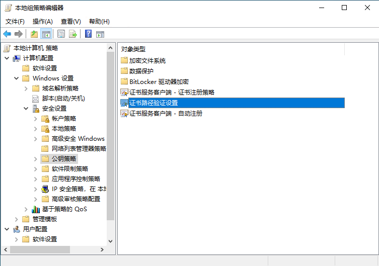
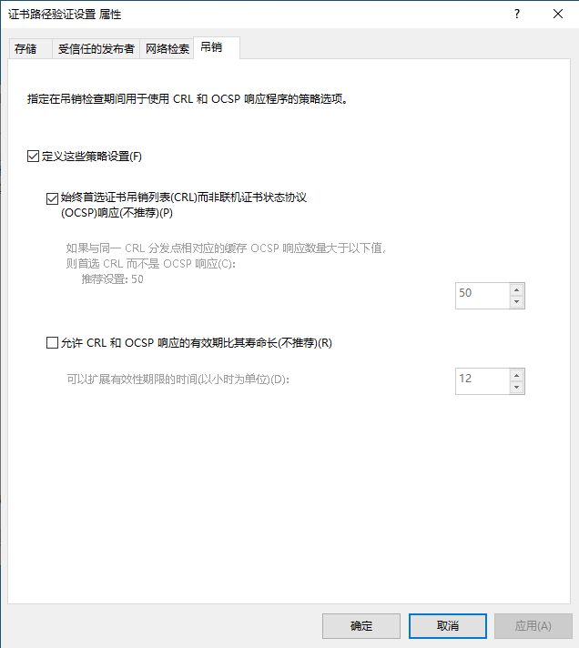
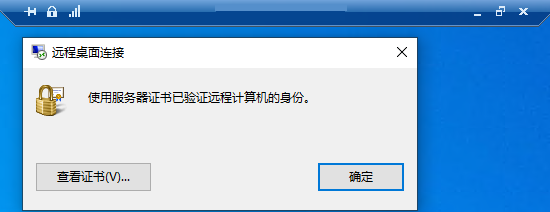

# OpenSSL-Windows-Issuer

 [Learn More](https://opensource.org/license/gpl-3-0/)

一个在 `Windows系统` 下使用 `OpenSSL` 自签发CA根证书和其他用途证书的脚本仓库, 并且支持将自签CA根证书用于 `Windows-RDP` 加密.

项目打赏/​捐赠地址：<https://owoblog.com/donation/>

## 简介

该项目包含了目前在Windows系统下所有可执行生成CA证书的bat脚本.

- `config.bat`: 全局变量 & 配置文件, 用于统一存放bat脚本运行时所需的变量
- `z.generateCertificateRevokeList.bat`: 生成证书吊销列表的脚本
- `z.issueCertificate.bat`: 签发 `CA根证书` 和 `CA证书` 的脚本
- `z.ocsp.bat`: 启动OCSP监听服务的脚本 (前提是已存在CA根证书和用于加密OCSP服务的证书)
- `z.ocsp-client.bat`: 启动OCSP客户端, 校验域名和证书是否有效的脚本
- `z.ocsp-stapling.bat`: 运行OCSP Stapling的脚本
- `z.registerTo-RDP-TCP.bat`: 将CA证书写入注册表, 用于加密远程桌面连接
- `z.revokeCertificate.bat`: 吊销证书
- `z.URL-Verify.bat`: 启动 `Windows URL检索工具` 检索域

## 一. 配置Nginx反代服务

1. Nginx的具体安装教程请自行使用搜索引擎.
2. 将根目录下的配置文件 `ssl.ocsp.service.conf` 移动到你的Nginx Web配置文件目录下, 并使用 `nginx.conf` 加载.
3. 按需修改下面的配置:

    ```nginx
    server {
        listen 80;                  # OCSP服务监听端口必须为80, 及 HTTP模式!
        server_name yourdomain.com; # 这里改成用于监听OCSP服务的域名以进行反代

        # 这里你也可以自行配置 access_log.log 和 error_log.log, 具体配置方法请自行搜索.

        root ssl; # 这里填写OCSP服务的根目录

        # ... 省略其他配置 ...
    }
    ```

4. 创建对应 `root` 路径的文件夹.
5. 在根文件夹下创建 `CAcerts` 目录.
6. 重启Nginx服务.

## 二. 生成自签CA根证书 & CA证书

1. 安装 `OpenSSL`, 并将其安装路径下的 `bin` 目录添加到系统环境变量 `PATH` 中 (此处将不赘述如何安装OpenSSL了, 如果不会安装请自行搜索引擎查询)
2. 按需配置配置文件 `config.bat`. 下面将会讲解配置选项及其作用:

    ```bat
    @REM 证书最大有效天数
    set days=1095

    @REM 需要签发的域名
    set domain=yourdomain.com

    @REM 证书名称
    set certName=%domain%

    @REM 配置文件
    set config=openssl.%domain%.cnf

    @REM 根证书CA名称
    set rootCAName=Your_Root_CA_Name

    @REM OCSP服务器IP (勿动)
    set ip=127.0.0.1:443

    @REM OCSP服务器域名
    set ocspServerUrl=http://your-OCSP-Server.com/ocsp

    @REM 证书序列号, 用于 OCSP-Client 脚本验证域名所用
    set serialNumber=01

    @REM 已签发证书指纹 (后期配置)
    set SSLCertificateSHA1Hash=YourSSLHash
    ```

3. 执行脚本 `z.issueCertificate.bat` 用于生成和颁发 **`CA根证书`** (若有已签发的CA根证书和根密钥, 请提前移入 `CAcerts` 文件夹内).
4. 将自签CA根证书安装到 `受信任的根证书颁发机构` 中 (需要在 `当前用户` 和 `本地计算机` 区域安装).
5. 将自签CA根证书下载到 `本地计算机`, 并重复第四点的步骤.
6. 完成上述步骤后, 回到 `远程计算机/服务器`, 进入 `pfx` 文件夹, 安装生成的证书包.
7. 若创建证书时填写了私钥加密密码, 在导入证书时需填写相同的密码, 反之直接回车即可. 证书需导入到  `当前用户` 和 `本地计算机` 的 **`个人` 区域**!!!
8. 打开运行 (或使用 `Win + R` 键打开运行), 输入 `certlm.msc` 打开本地计算机证书管理控制台, 找到导入的域名/证书.
9. 双击打开后, 找到 `指纹` 选项, 并复制替换其字符串Hash值到配置文件的 `YourSSLHash` 中.
10. 运行 `z.registerTo-RDP-TCP.bat` 注册证书到远程桌面连接服务.

## 三. 配置OCSP服务

1. 将生成的CA根证书移动到Nginx配置的 `CAcerts` 目录下. 注意, **不要拷贝私钥 `.key`** !
2. 执行脚本 `z.generateCertificateRevokeList.bat` 脚本. 将生成的 `rootca.crl` 移动到Nginx配置的根目录下.
3. 执行脚本 `z.ocsp.bat` 脚本以启动 OCSP 服务.

## 四. 配置RDP-TCP

1. 如下图, 打开运行 (或使用 `Win + R` 键打开运行), 输入 `gpedit.msc` 打开本地策略组.
   
2. 找到图片中所表述的路径: **计算机配置 -> Windows设置 -> 安全设置 -> 公钥策略**.
3. 双击 `证书路径设置`.
4. 根据下图配置你的本地设置.
   
5. 配置完成之后, 断开并重新连接你的远程服务桌面, 则会成功显示安全加密图标.
   

## 五. 验证证书

1. 执行脚本 `z.URL-Verify.bat`, 测试三项 (Certs, CRLs, OCSP) 是否正常. 若 OCSP 显示没有签发者是正常的, 因为Windows无法校验自签发的CA证书.
2. 执行脚本 `z.ocsp-client.bat` 可以检查证书的到期状态 (若没有提前吊销证书, 则会显示 `good` 字样; 否则会显示 `revoked` 字样).

## 项目声明

&copy; 2016-2023 [`OwOBlog-DGMT`](https://www.owoblog.com). Please comply with the open source license of this project for modification, derivative or commercial use of this project.

My Contacts:

- Website: [`HanskiJay`](https://www.owoblog.com)
- Telegram: [`HanskiJay`](https://t.me/HanskiJay)
- E-Mail: [`HanskiJay`](mailto:support@owoblog.com)
